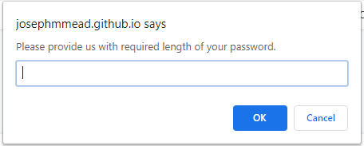

# Password Generator 

With this project, the objective was to create a functional password generator. There are a few different attributes to this generator.The first is being able to press the button to have a randomly generated password appear. To have this password appear though, one most go through the prompts. These prompts will set the guidelines of your password. The prompts ask you:

1. How long would you like your password to be? 

2. Which is followed by an alert box stating how long your password is.

<img src = "readMeAssets/passwordLengthConfirmation.PNG"

3. After this, you will be asked if you what to include lower case letters in your password.

<img src ="readMeAssets/lowerCase.PNG"

4. A box asking if you want to have upper case letters.

<img src ="readMeAssets/upperCase.PNG"

5. A box asking if you want to have special characters letters.

<img src ="readMeAssets/specialChar.PNG"

6. Lastly, you will be asked if you want numbers in your password.

<img src ="readMeAssets/numbers.PNG"

7. After all of these you are presented with a password. 

<img src ="readMeAssets/randomPassword.PNG"
